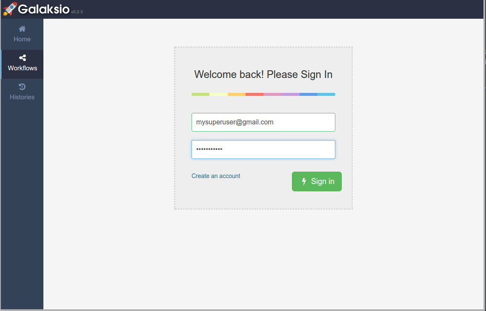
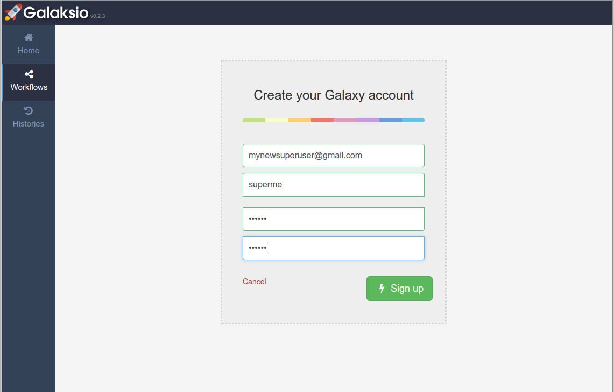

    

# Users in Galaksio
Galaksio has been designed to share the Galaxy user system. That means that if you already have a user account in the associated Galaxy server, you won't need to create a new account. Instead, you can easily sign-in Galaksio using your Galaxy credentials and all your data in Galaxy will be accessible from Galaksio.

    
    
Figure 1. Sign-in form in Galaksio.

However, if you don't have an account in Galaxy, you can easily create a new account using the sign-up form. That will take you just few seconds!

    
    
Figure 2. Creating a new account in Galaksio/Galaxy.

